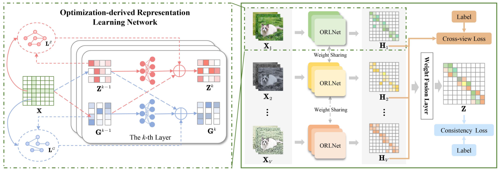

<h2 align="center"> <a href="https://link.springer.com/article/10.1007/s10462-025-11224-8">Representation Learning Meets Optimization-derived Networks: From Single-view to Multi-view
</a></h2>

<div align="center">

**Zihan Fang<sup>1,2</sup>, Shide Du<sup>1,2</sup>, Zhiling Cai <sup>3</sup>, Shiyang Lan<sup>1,2</sup>, Chunming Wu<sup>1,2</sup>, Yanchao Tan<sup>1,2</sup>, Shiping Wang<sup>1,2</sup>**

<sup>1</sup>College of Computer and Data Science, Fuzhou University, Fuzhou 350108, China<br>
<sup>2</sup>Key Laboratory of Intelligent Metro, Fujian Province University, Fuzhou 350108, China<br>
<sup>3</sup>College of Computer and Information Science, Fujian Agriculture and Forestry University, Fuzhou 350002, China<br>
</div>

## Abstract
Existing representation learning approaches lie predominantly in designing models empirically without rigorous mathematical guidelines, neglecting interpretation in terms of modeling. In this work, we propose an optimization-derived representation learning network that embraces both interpretation and extensibility. To ensure interpretability at the design level, we adopt a transparent approach in customizing the representation learning network from an optimization perspective. This involves modularly stitching together components to meet specific requirements, enhancing flexibility and generality. Then, we convert the iterative solution of the convex optimization objective into the corresponding feed-forward network layers by embedding learnable modules. These above optimization-derived layers are seamlessly integrated into a deep neural network architecture, allowing for training in an end-to-end fashion. Furthermore, extra view-wise weights are introduced for multiview learning to discriminate the contributions of representations from different views. The proposed method outperforms several advanced approaches on semi-supervised classification tasks, demonstrating its feasibility and effectiveness.

## Model Architecture
<div align="center">
  
</div>

## Experiment
We conducted experiments on six publicly available multi-view datasets:

| Datasets      | View 1            | View 2              | View 3                 | View 4        | View 5        | View 6        | # Samples | # Classes |
|---------------|-------------------|---------------------|------------------------|---------------|---------------|---------------|-----------|-----------|
| HW            | FAC (153)         | FOU (596)           | ZER (157)              | KAR (301)     | MOR (27)      | INT (481)     | 2,000     | 10        |
| MIRFlickr    | Textual (100)     | Visual (100)        | –                      | –             | –             | –             | 12,154    | 7         |
| NUS-WIDE     | CH (64)           | CM (225)            | CoRR (144)             | EDH (73)      | WT (128)      | SIFT (500)    | 1,600     | 8         |
| NUS20k       | Textual (100)     | Visual (100)        | –                      | –             | –             | –             | 20,000    | 8         |
| WebKB-texas  | Content (1,703)   | Citation (230)      | –                      | –             | –             | –             | 187       | 5         |
| Youtube      | MFCC (2,000)      | Volume Stream (64)  | Spectrogram Stream (1,024) | CH (512) | HME (64)      | HOG (647)     | 2,000     | 10        |


Additional datasets can be downloaded at the following links:
[Google Drive](https://drive.google.com/drive/folders/1Jh4IHkpoLcFe6slS_-jXZ7uFqYIaNJ-1)


## Reference

If you find our work useful in your research, please consider citing:

```
@article{fang2024representation,
  title={Representation Learning Meets Optimization-Derived Networks: From Single-View to Multi-View},
  author={Fang, Zihan and Du, Shide and Cai, Zhiling and Lan, Shiyang and Wu, Chunming and Tan, Yanchao and Wang, Shiping},
  journal={IEEE Transactions on Multimedia},
  year={2024},
  volume={26},
  pages={8889-8901},
  publisher={IEEE}
}
```
